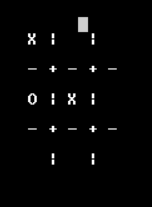
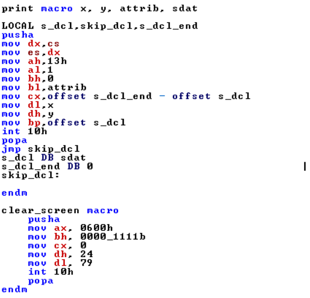

# Tic-Tac-Toe-Assembly-8086
Tic Tac Toe Implementation in Assembly 8086

## Details

It is normal tic tac toe but thing is that it is implemented in Assembly Code. It is fun to check how assembly works over bit complex codes. So in this code, I try to implement various macros in assembly such as Print Message at prifix location, Clear Scree and checking conditions to put 'O' or 'X'.

## Macros for easy to do some functioinality

<h4>Figure 1: Print Macro for print something and Clear macro for clearing screen</h4>

### In Figure 1, you can see there is two macros created for printing and clearing screen. there are four parameters in print macro.
 
1. x :- Location of x in screen or column of main screen where our text start printing.
1. y :- Location of y in screen or row of main screen where our text start printing.
1. attrib :- is used to define foreground color and background color. 1st 4bits for background and 2nd 4bits for foreground.
1. sdat :- Data used to print on screen.

There are local variable to make printing more operational.
used as pointers to print data 
s_dcl - locate starting position of string
skip_dcl - Part which contain string
s_dcl_end - locate ending position of string

after that there is command called "pusha"
it stores previous information in stack.

