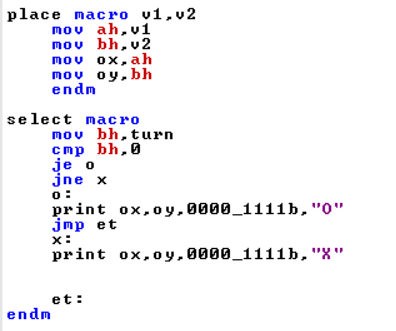
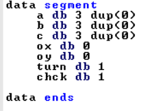

# Tic-Tac-Toe-Assembly-8086
Tic Tac Toe Implementation in Assembly 8086

## Details:-

It is normal tic tac toe but thing is that it is implemented in Assembly Code. It is fun to check how assembly works over bit complex codes. So in this code, I try to implement various macros in assembly such as Print Message at prifix location, Clear Scree and checking conditions to put 'O' or 'X'.

## Macros for easy to do some functioinality:-

### Print And Clear Screen Macro:-

<h4 align="center">Figure 1: Print Macro for print something and Clear macro for clearing screen</h4>

### Print Macro Explaination:-

In Figure 1, you can see there is two macros created for printing and clearing screen. there are four parameters in print macro.
 
1. x :- Location of x in screen or column of main screen where our text start printing.
1. y :- Location of y in screen or row of main screen where our text start printing.
1. attrib :- is used to define foreground color and background color. 1st 4bits for background and 2nd 4bits for foreground.
1. sdat :- Data used to print on screen.

There are local variable to make printing more operational.
used as pointers to print data 
s_dcl - locate starting position of string
skip_dcl - Part which contain string
s_dcl_end - locate ending position of string

after that there is command called "pusha"
it stores previous information in stack.

Now following things will happen in code.

1. move Code Segment to extra segment for display
1. setting Interupt 13 hex High and 1 hex low for display on screen with location
1. put formatting information in Base Register
1. provide string character counter for printing data
1. provide print location in data register
1. provide start location to base pointer for printing
1. now generate interupt of 10 hex for print
1. after print done restore register value from stack and macro over.

### Clear Screen Macro Explaination:-

1. Store all register values to stack
1. Set intterupt routine to clear screen
1. set formatting setting in base register such as forecolor and backcolor
1. set cx to zero because nothing to print just have to clear
1. so here we scroll thing in terms of DL = Right Column Number and DH Lower Row Number to clean.
    1. I used approximate value according need
1. Now provide 10h interupt routine to run code.
1. after interup routine, code restore all register value

for more info check this link:- https://en.wikipedia.org/wiki/INT_10H

### Macro for placing 'O' and 'X' in screen and memory

<h4 align="Center">Figure 2:- Place and selection macro</h4>

 
    So over here nothing so special is done, Here we store state of game markers in data segment and print output 'O' and 'X' on screen.
    Cool thing is that 8086 support mouse input with 33h interupt check this. 
    link:- http://www.ablmcc.edu.hk/~scy/CIT/8086_bios_and_dos_interrupts.htm#int33h_0000h 
    In today's world, it is quite easy to use mouse but still it is joyful to use mouse in assembly.

#### Place macro explaination:-

1. steps one copy data from macro variable to register
1. store those value in datasegment's variable ox,oy
    1. it is location to place marker
1. done

Note:- this variable is later used for checking

#### Select Macro explaination:-

1. first get turn variable to check who's turn. it is either 'O' or 'X'.
2. if turn is for 'O' then it is used to set status flag and according instruction pointer jumps
3. after jumping it set 'X' or 'O' marker at location which is store in ox,oy of Data Segment
    1. it is stored by place macro
4. Done.

## Data Segment Explaination:-

<h4 align="center">Figure 3:- Data Segment</h4>

    Data segment has minimal variables used to store state of game. such as turn, 9 block's state, last print location, 

    1. a - used to store 1st row of game
    1. b - used to store 2nd row of game
    1. c - used to store 3rd row of game
    1. ox,oy - used to store location of print 'O' and 'X'
    1. turn - used to store turn of user
    1. chck - for chceking ending of game or not. 

